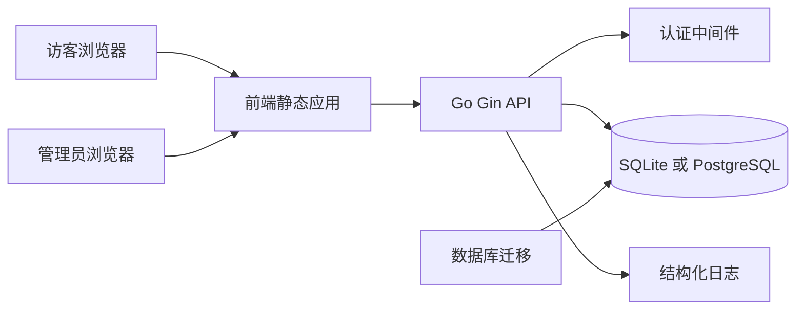

# WindNav 架构与实施计划

## 1. 产品范围

WindNav 是一个前后端分离的自建导航页应用。

第一版范围：

- 公开导航页：所有访客可访问，用于浏览、搜索、筛选导航站点。
- 后台管理：需要登录，用于维护分类、站点、标签和基础系统配置。
- 单租户优先：第一版不做多空间、多团队权限隔离。
- 简洁轻快风格：界面轻量、留白清晰、交互直接，避免复杂装饰。

## 2. 推荐技术栈

后端：

- Go
- Gin：HTTP 路由、中间件、接口处理。
- SQLite：默认数据库，适合单机、NAS、个人服务器等最简部署。
- PostgreSQL：可选数据库，适合正式服务化部署和未来扩展。
- GORM：ORM、模型映射、查询构建和事务管理。
- gorm.io/driver/sqlite：SQLite 驱动。
- gorm.io/driver/postgres：PostgreSQL 驱动。
- GORM AutoMigrate 或按方言维护迁移脚本：第一版优先保证双数据库兼容。
- bcrypt：密码哈希。
- JWT 或服务端刷新令牌：后台登录态。
- zap 或 slog：结构化日志。

前端：

- Vue 3
- Vite
- TypeScript
- Tailwind CSS
- Vue Router：页面路由。
- Pinia：后台登录态、用户信息和轻量全局状态。
- TanStack Query for Vue：接口请求、缓存、加载态。
- VeeValidate + Zod：后台表单和校验。
- lucide-vue-next：图标。

部署：

- 最简部署：单个后端服务 + SQLite 数据文件 + 前端静态资源。
- 标准部署：Docker Compose 包含 backend、frontend 或 nginx、postgres。
- 前端构建为静态资源，可由 nginx 托管，也可由后端静态服务托管。第一版建议支持后端托管静态资源以简化 SQLite 部署，同时保留 nginx 方案。

## 3. 数据库策略

第一版同时支持 SQLite 和 PostgreSQL。

- 通过环境变量 DB_DRIVER 切换数据库类型，取值建议为 sqlite 或 postgres。
- SQLite 使用 DB_SQLITE_PATH 指定数据文件路径，默认可放在 ./data/windnav.db。
- PostgreSQL 使用 DATABASE_URL 或独立的 host、port、user、password、dbname 配置。
- 领域模型保持数据库无关，避免依赖特定数据库函数、字段类型或 SQL 方言。
- 排序、分页、搜索优先使用 GORM 可移植写法；全文搜索先用轻量 LIKE 查询，后续可为 PostgreSQL 增加增强搜索。
- 第一版建议使用 GORM AutoMigrate 建表，后续稳定后再补充数据库方言迁移脚本。

## 4. 总体架构



核心边界：

- 前端只负责展示、交互、路由和调用 API。
- 后端负责认证、权限、业务规则、数据校验和持久化。
- 公开 API 与后台 API 分组隔离，后台 API 统一走认证中间件。

## 5. 后端领域模型

建议第一版表结构：

### users

- id
- username
- password_hash
- display_name
- role
- is_active
- last_login_at
- created_at
- updated_at

说明：第一版只需要 admin 角色，但保留 role 字段方便扩展。

### categories

- id
- name
- slug
- description
- icon
- color
- sort_order
- is_visible
- created_at
- updated_at

说明：分类用于公开页分组展示和后台管理。

### sites

- id
- category_id
- title
- url
- description
- icon_url
- fallback_icon
- sort_order
- is_pinned
- is_visible
- click_count
- created_at
- updated_at

说明：公开页默认只返回 is_visible=true 的站点。

### tags

- id
- name
- slug
- color
- created_at
- updated_at

### site_tags

- site_id
- tag_id

### settings

- key
- value
- value_type
- updated_at

建议配置项：

- site_title
- site_subtitle
- search_placeholder
- enable_dark_mode
- default_theme

### refresh_tokens 或 sessions

- id
- user_id
- token_hash
- expires_at
- revoked_at
- created_at

说明：如果第一版采用短期 JWT + 刷新令牌，则需要该表。如果采用服务端 Session，也可以改为 sessions 表。

## 6. API 契约草案

统一响应结构：

```json
{
  "data": {},
  "error": null,
  "meta": {}
}
```

错误响应：

```json
{
  "data": null,
  "error": {
    "code": "VALIDATION_ERROR",
    "message": "请求参数无效",
    "details": {}
  },
  "meta": {}
}
```

公开接口：

- GET /api/public/summary：站点标题、描述、主题配置。
- GET /api/public/categories：公开分类列表。
- GET /api/public/sites：公开站点列表，支持 category、tag、q、page、page_size、sort。
- POST /api/public/sites/:id/click：记录点击次数。

认证接口：

- POST /api/auth/login：登录。
- POST /api/auth/refresh：刷新登录态。
- POST /api/auth/logout：退出。
- GET /api/auth/me：当前用户。

后台接口：

- GET /api/admin/categories
- POST /api/admin/categories
- PUT /api/admin/categories/:id
- DELETE /api/admin/categories/:id
- GET /api/admin/sites
- POST /api/admin/sites
- PUT /api/admin/sites/:id
- DELETE /api/admin/sites/:id
- GET /api/admin/tags
- POST /api/admin/tags
- PUT /api/admin/tags/:id
- DELETE /api/admin/tags/:id
- GET /api/admin/settings
- PUT /api/admin/settings

分页与排序：

- page：从 1 开始。
- page_size：默认 20，最大 100。
- sort：如 sort_order、created_at、click_count。
- order：asc 或 desc。

## 7. 前端页面结构

公开区：

- /：导航首页。
- 分类栏：横向或侧边，移动端变为顶部滚动筛选。
- 搜索框：支持站点名称、描述、标签搜索。
- 站点卡片：图标、标题、简短描述、标签、外链打开。
- 空状态：搜索无结果时显示轻量提示。

后台区：

- /admin/login：登录页。
- /admin：后台首页，可展示站点数量、分类数量、最近更新。
- /admin/sites：站点管理，支持新增、编辑、隐藏、删除、排序、筛选。
- /admin/categories：分类管理，支持新增、编辑、隐藏、排序。
- /admin/tags：标签管理。
- /admin/settings：基础配置。

## 8. 视觉方向

关键词：简洁、轻快、清晰、可扫描。

设计原则：

- 主色建议使用清新的蓝绿或青色系作为强调色，但整体不要单色化。
- 背景使用接近白色的浅灰，卡片白底，边框轻，阴影克制。
- 卡片圆角控制在 8px 内，避免过度圆润。
- 字体层级清楚：首页标题适中，卡片标题紧凑。
- 导航站点卡片采用稳定尺寸，避免图标或描述长度导致布局跳动。
- 图标优先使用 lucide-vue-next，站点自定义图标作为补充。
- 移动端优先保证搜索和分类切换高效。
- 支持暗色模式可作为第一版可选项，若实现则需要明确颜色 token。

## 9. 推荐项目目录

```text
windnav/
  backend/
    cmd/server/
    internal/config/
    internal/db/
    internal/http/
    internal/middleware/
    internal/model/
    internal/repository/
    internal/service/
    internal/validator/
    migrations/
    go.mod
  frontend/
    src/api/
    src/components/
    src/features/public/
    src/features/admin/
    src/layouts/
    src/router/
    src/stores/
    src/styles/
    package.json
  deploy/
    docker-compose.yml
    nginx.conf
  docs/
    api.md
    architecture.md
  plans/
    windnav-architecture-plan.md
  README.md
```

## 10. 实施顺序

1. 初始化仓库结构：backend、frontend、deploy、docs、plans。
2. 初始化后端 Go 模块，引入 Gin、GORM、SQLite 驱动、PostgreSQL 驱动、配置、日志、健康检查。
3. 实现数据库初始化：按 DB_DRIVER 创建 SQLite 或 PostgreSQL 连接，并执行 GORM AutoMigrate。
4. 实现后端分层：handler、service、repository、middleware。
5. 实现认证：初始化管理员账号、登录、刷新、退出、认证中间件。
6. 实现公开 API：公开配置、分类、站点列表、搜索、点击统计。
7. 实现后台 API：分类、站点、标签、设置 CRUD。
8. 初始化前端 Vue 3 项目：路由、Pinia、Tailwind、请求客户端、基础布局。
9. 实现公开导航页：搜索、分类筛选、站点卡片、响应式布局。
10. 实现后台登录和管理页：站点、分类、标签、设置。
11. 增加部署配置：SQLite 单服务最简部署、Docker Compose PostgreSQL 标准部署、前端静态服务或 nginx。
12. 补充文档：本地开发、环境变量、数据库初始化、双数据库切换、部署说明。

## 11. 验证标准

后端：

- go test ./... 通过。
- SQLite 和 PostgreSQL 两种模式均可在空数据库上完成初始化。
- 健康检查接口可访问。
- 登录失败、登录成功、受保护接口未登录访问均符合预期。
- 公开接口不需要登录。

前端：

- npm run build 通过。
- 首页可展示公开分类和站点。
- 搜索、分类筛选、移动端布局可用。
- 后台未登录时跳转登录页。
- 后台表单有基础校验和错误提示。

部署：

- SQLite 模式可不依赖外部数据库启动完整服务。
- docker compose up 可启动 PostgreSQL 标准部署。
- 环境变量缺失时后端给出明确错误。
- 前端能够通过配置访问后端 API。

## 12. 下一步

如果该计划确认可行，下一步切换到 Code 模式，按实施顺序创建项目骨架、初始化后端和前端，并补齐第一版基础功能。
